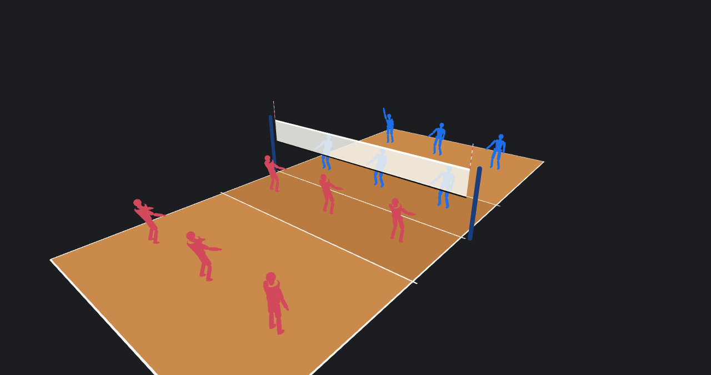

# Volleyball Strategy Simulator

[](https://volleyball-simulator.vercel.app)
[](LICENSE)
[](https://vitejs.dev)
[](https://react.dev)
[](https://threejs.org)
[](https://www.typescriptlang.org)

A 3D volleyball strategy tool for coaches, not a game. Build a roster and lineup, step through the six rotations with live overlap-legality checking, author a play by dragging players around a real court, and watch it animate with real ball physics from any camera angle. It plans an actual game plan: "here's what we run in rotation 3 against a short serve."

**[Try it live](https://volleyball-simulator.vercel.app)**. No install needed.



## What it does today

- **Rotation engine.** A real 5-1/6-2/4-2 roster you can actually edit (add a sub with a name/number/role, remove one — not fixed to whatever shipped in the demo data), drag-and-drop lineup editing, and all six rotations with overlap-rule validation. Illegal alignments get flagged live: a 3D connector draws between the offending pair, and a margin shows for every pair, not just violations. The libero renders in its own color so it's never confused with a regular starter, and an on-court bench (past each team's own endline) lets you drag a player onto the field or back off it directly in 3D. The Roster/Lineup/Rotation/Validation/Formation/Bench panel is opt-in behind the same "Advanced" toggle author mode uses, so the default formation view is just the court.
- **Guided play authoring.** Click a player, pick what they do (serve, pass, set, attack, tip, block, dig, or just reposition), then place where the ball goes on a to-scale top-down court map (or click the spot directly in the 3D view) and drag a simple side-view marker to set how high it arcs. A setter's "set" picks a target hitter and a tempo instead of a raw coordinate. A serve always starts from behind the endline, and every other contact walks the player to wherever the previous step's ball actually lands, instead of freezing them in place while the ball arrives somewhere else on screen. The running step list supports Edit (re-open *any* step, not just the last one, with its choices pre-filled, and everything after it re-resolves against the change) and Remove, not just read-only review; swapping who's on the court mid-authoring goes through the same on-screen bench panel formation mode already uses. It's the exact same play data the advanced editor uses underneath: flip "Advanced" on at any point to fine-tune the same play by hand. Advanced is the older, denser timeline editor (below), now opt-in rather than the default.
- **Play authoring (advanced).** Script a sequence of steps (serve, pass, set, attack), then either type exact coordinates, grab a player in the 3D view and drop them where you want (with a ghost marker showing where they started, and Alt held to snap to the nearest zone anchor), or drag the ball itself to a step's From or To point directly. That drag is the primary editing gesture. Undo/redo, save to your browser, and diagnostics catch a move no human could physically make (with a one-click "extend this step" fix) or a ball that would clip the net, before you even hit play. A play library panel lists every saved play with its step count and duration, with inline rename.
- **Deterministic playback.** Real closed-form ball arcs, pose-blended player movement, a short fading trail behind the ball in flight, scrub/play/loop/speed controls. The same play looks identical every time. No randomness, no drift.
- **Serve-receive planning.** Pick your passers (with adjustable range for a libero or primary passer), a serve origin, and watch a live coverage heatmap over the whole receiving court: green where a passer can get there in time, red where no one can. Five formation presets (W, 3-passer, 2-passer, stack-left/right) set up a starting look in one click. Place an exact serve target on a to-scale court map and pick float or jump serve speed to get a straight answer for that one aimed serve, not just the whole grid.
- **Attack/defense matchups.** Pick an attack zone (4/3/2 for OH/MB/RS, or 6 for a back-row pipe), a set tempo, and optionally a specific roster player to hit it (their own reach and jump feed the contact height instead of a flat default). See the hitter's approach lane, whether the assigned block can actually get there in time ("blocker cannot reach: needs 1.05s, has 0.45s") — and spread vs. a bunch block now produce genuinely different numbers, not just different labels — the block shadow drawn live on the defending team's court with any defender caught standing in it flagged, open-angle cones flanking the block showing which side is left uncovered, and tip coverage for an assigned defender. Four defensive systems (perimeter, rotation, man-up, six-back) reposition the defending team on court and feed the same feasibility math, and a manual formation override always wins over the system's own default.
- **Presentation mode.** One click hides every editing panel and enlarges the transport into big, touch-friendly controls for showing a play to a team at practice. It keeps the screen awake on a tablet while it's up, where the browser supports that, and Esc gets back out.
- **PNG rotation sheet export.** One click captures all six rotations of the focused team as one labeled image, from whichever camera angle you pick (top-down by default), ready to print or share. No server involved: it's the same canvas already on screen.
- **Validation tools that fix themselves.** An illegal overlap alignment gets a one-click "Fix alignment" button (the same nudge-to-legal math that used to only be testable, not usable) and a "Focus" button that points the camera straight at the violating pair.

Players render as flat, orbit-camera-friendly humanoid silhouettes holding real volleyball stances (dig, block, attack, set, and more). The net has padded posts, a visible gap above the floor, and banded top and bottom edges. Rotate, pan, and zoom freely, or jump to one of five camera presets (top-down, sideline, behind the endline, two angled views). Every color reads from a swappable theme, so the whole look can change without touching a line of game logic.

## Status

All seven planned phases are done: scaffold, court/camera/silhouettes, the rotation engine, the play model and deterministic playback, a full authoring UI (timeline editor, step inspector, 3D drag-to-position, ball-path editing, undo/redo, save), serve-receive coverage analysis, attack/defense matchup analysis, and presentation/export polish. Several rounds of guided-authoring polish followed — completion colors, a to-scale top-down target picker, players who walk to meet the ball instead of standing still, concurrent player movement, uniform-speed ball flight — and then a full backlog-closure pass that shipped nearly every item this project had honestly documented as unfinished: real position-override consistency everywhere, a play library, `Movement.facing`, a ball trajectory trail, deduplicated and click-to-aim serve-receive, block-scheme realism and open-angle cones in the matchup planner, 3D ball dragging with a drag ghost and zone-snapping, a sitting bench pose, and Zod-validated saved-play persistence. The app is live on Vercel, deployed straight from `main`. See [Roadmap](#roadmap) below, and [HANDOFF.md](HANDOFF.md) for a working session's worth of context on where things stand, decisions made, and pitfalls already worked through.

## Tech stack

- [Vite](https://vitejs.dev/) + [React 19](https://react.dev/) + TypeScript (strict)
- [Three.js](https://threejs.org/) for the 3D scene, driven imperatively (not react-three-fiber), so the frame loop stays independent of React's render cycle
- [Zustand](https://github.com/pmndrs/zustand) for UI state: one store per concern (lineup/roster, playback, the play being authored, serve-receive config, matchup config)
- [Vitest](https://vitest.dev/) for the domain layer, which runs headless in Node. The volleyball rules (rotation math, overlap validation, ball flight, deterministic playback) have zero dependency on a browser or a renderer. The test suite proves it: if any of them could even import `three`, the run fails.

The codebase draws a hard line between `src/core` (pure volleyball domain logic, with no rendering imports at all) and `src/render` (the Three.js scene, which reads a swappable `Theme` object). An ESLint rule enforces that boundary, not just convention, which is what makes the visual style fully replaceable without touching any game logic.

## Getting started

```bash
npm install
npm run dev
```

Then open the printed local URL. Other useful commands:

```bash
npm test      # run the domain test suite (Vitest, headless)
npm run lint  # ESLint, including the core/render boundary rule
npm run build # production build
```

## Roadmap

- [x] **Phase 0.** Project scaffold.
- [x] **Phase 1.** Court, net, orbit camera, pose-able silhouettes, theme system.
- [x] **Phase 2.** Rotation engine (roster, lineups, 5-1/6-2/4-2 systems, overlap validation).
- [x] **Phase 3.** Play model and deterministic playback: ball flight, compile/evaluate, diagnostics, pose-blended animation, 3 demo plays.
- [x] **Phase 4.** Play authoring UI (timeline editor, step inspector, 3D drag-to-position, ball-path editing, undo/redo, save), plus a real play library panel (browse/rename/delete, not just a dropdown).
- [x] **Phase 5.** Serve-receive planner: weighted responsibility zones, seam detection, the uncovered-area time-margin heatmap, five formation presets, and a click-to-aim single-serve reading with a float/jump speed toggle.
- [x] **Phase 6.** Attack/defense matchups: approach lanes by role, block feasibility diagnostics (now with real spread-vs-bunch positional differences, not just a label change), block shadow with defender-in-shadow flagging, open-angle cones flanking the block, tip coverage, player-based hitter contact height, and four defensive base formations that respect a manual formation override.
- [x] **Phase 7.** Polish and deploy: presentation mode (panels hidden, large touch-first transport, screen wake lock) and a one-click PNG rotation-sheet export. Deployed to Vercel from `main`.
- [x] **Post-v1.** Simple mode by default for author view (the timeline/step-inspector sidebar moves behind an "Advanced" toggle), a distinct libero color, an on-court bench for dragging players on and off the field, and a guided click-through workflow for building a play without touching a coordinate field.
- [x] **Post-v1, round 2.** Formation mode's own sidebar joined the same Advanced toggle. Guided authoring got a completion color for players who already have an action, Edit/Remove on the step list, a to-scale top-down target picker alongside the height picker, players who walk to meet the ball instead of holding position, a serve that starts behind the endline, and a Bench section for swapping who's on the court without leaving Design Play. Roster editing (add/remove a player, not just the fixed demo data) landed alongside it, since the bench had nothing to show without real depth on the roster. A rough edge worth knowing about: the guided workflow's set-target chooser overloads one internal field to carry both the chosen hitter and tempo rather than using two dedicated fields; it works, but a fresh implementation would split it. See [HANDOFF.md](HANDOFF.md) for the rest.
- [x] **Post-v1, round 3.** Fixed a real playback bug: the ball could lag at its landing spot, jump somewhere else, then snap back before the next motion played, and contact could happen while a player was still mid-approach instead of after. Also added a way to deselect a player mid-authoring, direct drag-to-reposition anywhere on the court (not just click-to-target), and removed every emoji from the UI in favor of plain text.
- [x] **Post-v1, round 4.** Contact actions no longer queue up one at a time: a reacting player now starts moving exactly when the incoming ball is launched and arrives exactly when it lands, so several players can be moving within the same span of time at once, and a hitter jumps to meet a set while it's still in the air instead of waiting for it to land. Also: the bottom theme/camera/pose-preview bar moved behind Advanced, the currently-selected player during authoring gets its own color (deselecting used to look like nothing happened), the ball-height picker shows a net-height reference line, and two on-screen benches now flank the court itself instead of a bench reachable only through a sidebar list — click Add or Remove and pick a player from a plain list, no drag required.
- [x] **Post-v1, round 5.** The ball's flight is now uniform-speed on the way up and the way down, instead of easing like a real (and, in feedback, "erratic-looking") projectile. An attack's jump now clears the net with real margin — it used to barely reach it. Removed the persistent "already has an action" color entirely: it turned out to be the actual cause of "deselecting doesn't do anything" confusion, not a leftover bug, so per direct feedback it's gone rather than patched. The default theme is now Court instead of Blueprint, and hitting Play after a finished (non-looping) play now restarts it from the top instead of sitting there doing nothing.
- [x] **Backlog closure.** A full pass through everything the project had honestly documented as unfinished, in eight independently-tested stages: guided-authoring cleanup (a real edit-any-step fix, not just the last step); manual position overrides finally respected everywhere (matchup mode, the on-court bench), plus one-click alignment fixing and camera-focus-on-violation; a step-duration floor, a camera-preset override for the rotation-sheet export, and a real play library panel; `Movement.facing` toward another player (empirically verified, not just derived on paper), a ball trajectory trail, and a real playback-restart bug fixed along the way; serve-receive's duplicated logic merged into one shared implementation, click-to-aim single-serve readings, and five formation presets; block-scheme realism and open-angle cones in the matchup planner (this project's own documented interpretation, since the original spec was silent on both); 3D ball dragging with a drag ghost and Alt-to-snap-to-zone in the advanced editor; and a sitting pose for benched players alongside Zod-validated saved-play persistence. See [HANDOFF.md](HANDOFF.md) for the full account, including two more real bugs found and fixed along the way that weren't on any list going in.

## License

MIT. See [LICENSE](LICENSE).
